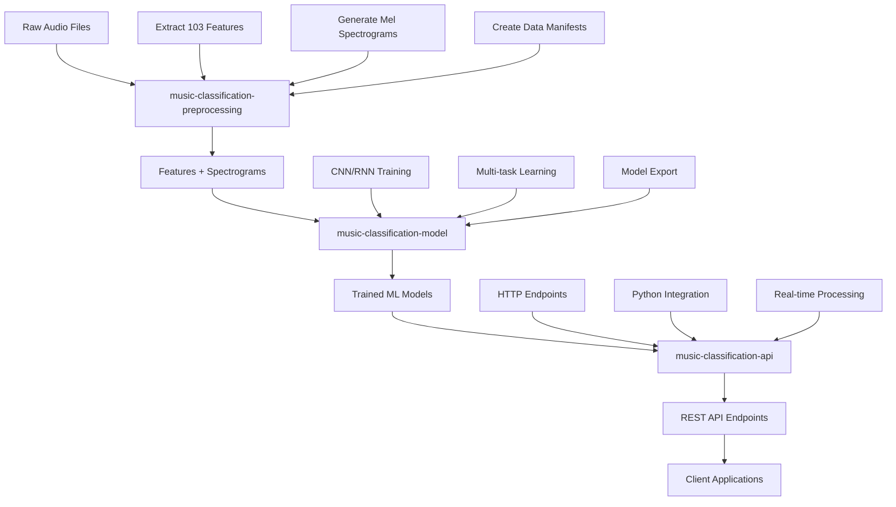

# 🎵 Music Classification API

**Author**: Sergie Code - Software Engineer & YouTube Programming Educator  
**Project**: AI Tools for Musicians  
**Date**: August 29, 2025  

[](https://dotnet.microsoft.com)
[](https://docs.microsoft.com/en-us/aspnet/core)
[](LICENSE)

A high-performance ASP.NET Core Web API that provides REST endpoints for music classification using AI models. This API serves as the production-ready frontend for the music classification pipeline, integrating with the preprocessing and ML model components.

## 📋 Table of Contents

- [What This Project Does](#-what-this-project-does)
- [System Architecture](#-system-architecture)
- [Integration with Other Projects](#-integration-with-other-projects)
- [API Endpoints](#-api-endpoints)
- [Installation & Setup](#-installation--setup)
- [Configuration](#-configuration)
- [Usage Examples](#-usage-examples)
- [Docker Deployment](#-docker-deployment)
- [Development](#-development)
- [Testing](#-testing)
- [Performance](#-performance)
- [Troubleshooting](#-troubleshooting)

## 🎯 What This Project Does

This ASP.NET Core Web API provides **REST endpoints for real-time music analysis**, capable of:

- **🎼 Genre Classification**: Detecting music genres (Rock, Pop, Jazz, Classical, Electronic, etc.)
- **😊 Mood Analysis**: Identifying emotional content (Happy, Sad, Energetic, Calm, etc.)
- **🥁 BPM Detection**: Estimating tempo in beats per minute
- **🎹 Key Detection**: Identifying musical keys (C, C#, D, etc.)

### Key Features

- **Multiple Input Methods**: Upload files, send base64 data, or use preprocessed features
- **Real-time Processing**: Fast response times suitable for production use
- **Robust Error Handling**: Comprehensive validation and error reporting
- **Swagger Documentation**: Auto-generated API documentation
- **Health Monitoring**: Built-in health checks and monitoring endpoints
- **Docker Ready**: Containerized deployment with Docker support
- **Production Optimized**: Logging, CORS, and security configurations

## 🏗️ System Architecture

### API Architecture

```
┌─────────────────┐    ┌─────────────────┐    ┌─────────────────┐
│   Client App    │    │  ASP.NET Core   │    │   Python ML     │
│                 │    │   Web API       │    │   Model Service │
│ - Web App       │───▶│                 │───▶│                 │
│ - Mobile App    │    │ - Controllers   │    │ - PyTorch Model │
│ - Desktop App   │    │ - Services      │    │ - Preprocessing │
│ - CLI Tool      │    │ - Models        │    │ - Inference     │
└─────────────────┘    └─────────────────┘    └─────────────────┘
```

### Request Flow

```
1. Client Request → 2. Input Validation → 3. Audio Processing → 4. Python ML Service → 5. Response Formatting → 6. JSON Response
```

### Internal Components

- **Controllers**: Handle HTTP requests and responses
- **Services**: Business logic and Python integration
- **Models**: Data transfer objects and configurations
- **Configuration**: Settings for Python integration

## 🔗 Integration with Other Projects

This API is part of a three-repository pipeline for complete music analysis:

### 1. **music-classification-preprocessing** (Data Pipeline)
- Processes raw audio files into features and spectrograms
- Extracts 103 audio features per file
- Generates mel spectrograms for CNN processing
- Creates manifest files for batch processing

### 2. **music-classification-model** (ML Backend)
- PyTorch-based CNN/RNN models for classification
- Multi-task learning (genre, mood, BPM, key)
- Model training and export functionality
- Python inference scripts

### 3. **music-classification-api** (This Repository - API Frontend)
- ASP.NET Core REST API for real-time classification
- Integrates preprocessing and model components
- Production-ready endpoints with documentation
- Docker containerization and deployment

### Integration Flow

```
Raw Audio Files → Preprocessing → Features + Spectrograms → Model Training → Trained Models → API Serving → Client Applications
```

## 🔌 API Endpoints

### Core Endpoints

| Method | Endpoint | Description |
|--------|----------|-------------|
| `POST` | `/api/music/analyze` | Analyze music from JSON payload |
| `POST` | `/api/music/analyze/upload` | Upload and analyze audio file |
| `POST` | `/api/music/analyze/preprocessed` | Analyze using preprocessed data |
| `GET` | `/api/health` | Health check and status |
| `GET` | `/api/health/info` | API information and capabilities |

### Swagger Documentation

When running in development mode, comprehensive API documentation is available at:
- **Swagger UI**: `http://localhost:5000/` (redirects to Swagger)
- **OpenAPI Spec**: `http://localhost:5000/swagger/v1/swagger.json`

## 🚀 Installation & Setup

### Prerequisites

- **.NET 9.0 SDK** or later
- **Python 3.9+** with the music classification model dependencies
- **Git** for cloning repositories

### Step 1: Clone All Repositories

```bash
# Create main directory
mkdir AI-Music-Tools
cd AI-Music-Tools

# Clone all three repositories
git clone <music-classification-preprocessing-repo> music-classification-preprocessing
git clone <music-classification-model-repo> music-classification-model
git clone <music-classification-api-repo> music-classification-api

# Directory structure should be:
# AI-Music-Tools/
# ├── music-classification-preprocessing/
# ├── music-classification-model/
# └── music-classification-api/
```

### Step 2: Setup Python Environment

```bash
# Setup preprocessing environment
cd music-classification-preprocessing
pip install -r requirements.txt
cd ..

# Setup model environment
cd music-classification-model
pip install -r requirements.txt

# Train or download a pre-trained model
python train.py --data ../music-classification-preprocessing/data/manifest.json --epochs 50

# Export model for API use
python export_model.py --model models/best_model.pth --output models/api_model.pth
cd ..
```

### Step 3: Setup .NET API

```bash
cd music-classification-api

# Restore .NET dependencies
dotnet restore

# Build the project
dotnet build

# Run the API
dotnet run
```

### Step 4: Verify Installation

```bash
# Test API health
curl http://localhost:5000/api/health

# Expected response:
{
  "status": "healthy",
  "timestamp": "2025-08-29T12:00:00Z",
  "services": {
    "api": "healthy",
    "python_model": "healthy",
    "preprocessing": "ready"
  }
}
```

## ⚙️ Configuration

### appsettings.json Configuration

```json
{
  "PythonModel": {
    "PythonExecutablePath": "python",
    "ModelScriptPath": "../music-classification-model/inference.py",
    "ModelFilePath": "../music-classification-model/models/api_model.pth",
    "TimeoutSeconds": 30,
    "WorkingDirectory": "../music-classification-model"
  },
  "Preprocessing": {
    "PreprocessingScriptPath": "../music-classification-preprocessing/src/cli.py",
    "TempDirectory": "temp",
    "MaxFileSizeMB": 50,
    "SupportedFormats": ["mp3", "wav", "flac", "m4a"]
  }
}
```

### Environment Variables

```bash
# Python configuration
export PythonModel__PythonExecutablePath="python3"
export PythonModel__ModelFilePath="/path/to/api_model.pth"

# Preprocessing configuration
export Preprocessing__TempDirectory="/tmp/music-api"
export Preprocessing__MaxFileSizeMB="100"

# ASP.NET Core configuration
export ASPNETCORE_ENVIRONMENT="Production"
export ASPNETCORE_URLS="http://+:5000"
```

## 📚 Usage Examples

### 1. Upload and Analyze Audio File

```bash
curl -X POST "http://localhost:5000/api/music/analyze/upload" \
     -H "Content-Type: multipart/form-data" \
     -F "file=@song.mp3"
```

**Response:**
```json
{
  "fileName": "song.mp3",
  "predictions": {
    "genre": {
      "label": "rock",
      "confidence": 0.85
    },
    "mood": {
      "label": "energetic",
      "confidence": 0.78
    },
    "bpm": {
      "value": 120.5,
      "category": "moderate",
      "confidence": 0.82
    },
    "key": {
      "label": "C",
      "confidence": 0.71
    }
  },
  "processingTimeMs": 2300,
  "metadata": {
    "duration": 180.5,
    "sampleRate": 44100,
    "fileSizeBytes": 4521840
  },
  "warnings": []
}
```

### 2. Analyze with JSON Payload

```bash
curl -X POST "http://localhost:5000/api/music/analyze" \
     -H "Content-Type: application/json" \
     -d '{
       "audioData": "base64_encoded_audio_data_here",
       "fileName": "test_song.wav",
       "format": "wav"
     }'
```

### 3. Analyze Preprocessed Data

```bash
curl -X POST "http://localhost:5000/api/music/analyze/preprocessed" \
     -H "Content-Type: application/json" \
     -d '{
       "featuresPath": "/path/to/song_features.json",
       "spectrogramPath": "/path/to/song_spectrogram.npy",
       "fileName": "song.wav"
     }'
```

### 4. Health Check

```bash
curl -X GET "http://localhost:5000/api/health"
```

### 5. API Information

```bash
curl -X GET "http://localhost:5000/api/health/info"
```

**Response:**
```json
{
  "name": "Music Classification API",
  "version": "1.0.0",
  "description": "ASP.NET Core API for music classification using AI models",
  "author": "Sergie Code",
  "endpoints": {
    "analyze": "/api/music/analyze",
    "upload": "/api/music/analyze/upload",
    "preprocessed": "/api/music/analyze/preprocessed",
    "health": "/api/health",
    "info": "/api/health/info"
  },
  "supported_formats": ["mp3", "wav", "flac", "m4a"],
  "features": {
    "genre_classification": true,
    "mood_detection": true,
    "bpm_estimation": true,
    "key_detection": true,
    "batch_processing": false,
    "real_time_processing": true
  }
}
```

## 🐳 Docker Deployment

### Build and Run with Docker

```bash
# Build the Docker image
docker build -t music-classification-api .

# Run the container
docker run -d \
  --name music-api \
  -p 5000:5000 \
  -v $(pwd)/../music-classification-model:/app/music-classification-model:ro \
  -v $(pwd)/../music-classification-preprocessing:/app/music-classification-preprocessing:ro \
  -v $(pwd)/temp:/app/temp \
  music-classification-api

# Check container status
docker ps

# View logs
docker logs music-api
```

### Docker Compose (Recommended)

```bash
# Start all services
docker-compose up -d

# Scale the API service
docker-compose up -d --scale music-classification-api=3

# View logs
docker-compose logs -f

# Stop services
docker-compose down
```

### Production Docker Deployment

```bash
# Build for production
docker build -t music-api:production -f Dockerfile.production .

# Run with production settings
docker run -d \
  --name music-api-prod \
  -p 80:5000 \
  --restart unless-stopped \
  -e ASPNETCORE_ENVIRONMENT=Production \
  -v /opt/music-models:/app/models:ro \
  music-api:production
```

## 🔧 Development

### Local Development Setup

```bash
# Run with hot reload
dotnet watch run

# Run with specific environment
dotnet run --environment Development

# Run tests
dotnet test

# Check code formatting
dotnet format
```

### Adding New Features

1. **Models**: Add new request/response models in `Models/`
2. **Services**: Implement business logic in `Services/`
3. **Controllers**: Add new endpoints in `Controllers/`
4. **Configuration**: Update `appsettings.json` for new settings

### Code Structure

```
MusicClassificationApi/
├── Controllers/           # API endpoints and HTTP handling
│   ├── MusicController.cs    # Music analysis endpoints
│   └── HealthController.cs   # Health and info endpoints
├── Services/             # Business logic and external integration
│   └── MusicClassificationService.cs
├── Models/               # Data transfer objects
│   ├── MusicAnalysisRequest.cs
│   ├── MusicAnalysisResponse.cs
│   └── Configuration.cs
├── Program.cs            # Application startup and configuration
├── appsettings.json      # Application configuration
└── Dockerfile           # Container configuration
```

## 🧪 Testing

### Unit Tests (Coming Soon)

```bash
# Run all tests
dotnet test

# Run with coverage
dotnet test --collect:"XPlat Code Coverage"

# Run specific test
dotnet test --filter "ClassName.MethodName"
```

### Integration Testing

```bash
# Test with real audio file
curl -X POST "http://localhost:5000/api/music/analyze/upload" \
     -F "file=@test_files/rock_song.mp3"

# Test health endpoint
curl "http://localhost:5000/api/health"

# Test with invalid file
curl -X POST "http://localhost:5000/api/music/analyze/upload" \
     -F "file=@test_files/invalid.txt"
```

### Performance Testing

```bash
# Load testing with Apache Bench
ab -n 100 -c 10 -T 'multipart/form-data' \
   -p test_files/small_audio.mp3 \
   http://localhost:5000/api/music/analyze/upload

# Or with curl in a loop
for i in {1..10}; do
  time curl -X POST "http://localhost:5000/api/music/analyze/upload" \
       -F "file=@test_files/test_song.mp3"
done
```

## ⚡ Performance

### Expected Performance Metrics

- **Response Time**: 2-5 seconds per audio file (30-180 seconds duration)
- **Throughput**: 10-20 requests per minute per instance
- **Memory Usage**: ~500MB-1GB per instance
- **CPU Usage**: Varies with Python model complexity

### Optimization Tips

1. **Caching**: Implement Redis caching for repeated requests
2. **Async Processing**: Use background queues for long-running tasks
3. **Model Optimization**: Use TorchScript or ONNX for faster inference
4. **Load Balancing**: Deploy multiple instances behind a load balancer

### Scaling Strategies

```yaml
# Kubernetes deployment example
apiVersion: apps/v1
kind: Deployment
metadata:
  name: music-classification-api
spec:
  replicas: 3
  selector:
    matchLabels:
      app: music-api
  template:
    spec:
      containers:
      - name: api
        image: music-classification-api:latest
        resources:
          requests:
            memory: "512Mi"
            cpu: "250m"
          limits:
            memory: "1Gi"
            cpu: "500m"
```

## 🔍 Troubleshooting

### Common Issues

#### 1. Python Model Not Found
```
Error: Python process failed with exit code 1
```

**Solution:**
- Verify Python path in configuration
- Ensure model file exists and is accessible
- Check Python dependencies are installed

#### 2. File Upload Fails
```
Error: No file uploaded
```

**Solution:**
- Check file size limits in configuration
- Verify supported file formats
- Ensure proper Content-Type headers

#### 3. Health Check Fails
```
Status: unhealthy
```

**Solution:**
- Check Python executable path
- Verify model dependencies
- Review application logs

### Debugging

```bash
# Enable detailed logging
export Logging__LogLevel__Default="Debug"

# Check application logs
docker logs music-api --follow

# Test Python integration separately
python ../music-classification-model/inference.py --help
```

### Monitoring

```bash
# API metrics endpoint (if implemented)
curl "http://localhost:5000/metrics"

# Container stats
docker stats music-api

# Health check
curl "http://localhost:5000/api/health"
```

## 🤝 How All Three Repositories Work Together

### Complete Workflow



### Development Workflow

1. **Data Preparation** (preprocessing repo):
   ```bash
   cd music-classification-preprocessing
   python src/cli.py preprocess-dataset music_files/ --output processed_data/
   ```

2. **Model Training** (model repo):
   ```bash
   cd music-classification-model
   python train.py --data ../music-classification-preprocessing/processed_data/manifest.json
   python export_model.py --model models/best_model.pth --output models/api_model.pth
   ```

3. **API Deployment** (this repo):
   ```bash
   cd music-classification-api
   dotnet run
   ```

4. **End-to-End Testing**:
   ```bash
   curl -X POST "http://localhost:5000/api/music/analyze/upload" -F "file=@test_song.mp3"
   ```

### Repository Dependencies

```
music-classification-api (This repo)
├── Depends on: music-classification-model (Python backend)
├── Integrates: music-classification-preprocessing (Feature extraction)
└── Provides: REST API for client applications

music-classification-model
├── Depends on: music-classification-preprocessing (Training data)
└── Provides: Trained models and inference scripts

music-classification-preprocessing
├── Depends on: Raw audio files
└── Provides: Features, spectrograms, and manifests
```

## 📞 Support & Contributing

### Getting Help

- **Documentation**: This README and Swagger UI documentation
- **Issues**: Use GitHub Issues for bug reports and feature requests
- **Discussions**: GitHub Discussions for questions and ideas

### Contributing

1. Fork the repository
2. Create a feature branch (`git checkout -b feature/amazing-feature`)
3. Make your changes with clear documentation
4. Add tests if applicable
5. Submit a pull request

### Code Style

- Follow C# coding conventions
- Use XML documentation comments
- Implement proper error handling
- Add unit tests for new features

## 📄 License

This project is licensed under the MIT License - see the [LICENSE](LICENSE) file for details.

## 🙏 Acknowledgments

- **Microsoft**: ASP.NET Core framework
- **PyTorch Community**: Machine learning framework
- **Audio Processing Libraries**: librosa, FFmpeg
- **YouTube Subscribers**: Feedback and feature requests

## 📞 Connect with Sergie Code

- 📸 Instagram: https://www.instagram.com/sergiecode
- 🧑🏼‍💻 LinkedIn: https://www.linkedin.com/in/sergiecode/
- 📽️ YouTube: https://www.youtube.com/@SergieCode
- 😺 GitHub: https://github.com/sergiecode
- 👤 Facebook: https://www.facebook.com/sergiecodeok
- 🎞️ TikTok: https://www.tiktok.com/@sergiecode
- 🕊️ Twitter: https://twitter.com/sergiecode
- 🧵 Threads: https://www.threads.net/@sergiecode

---

**Happy coding and music making! 🎵**

Built with ❤️ by [Sergie Code](https://github.com/sergiecode) for the AI Tools for Musicians series.
